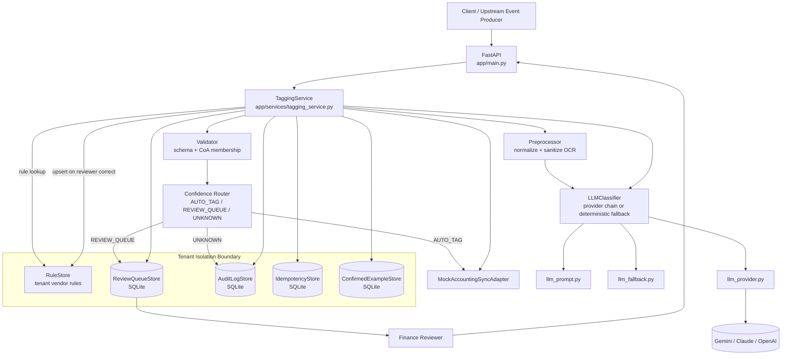
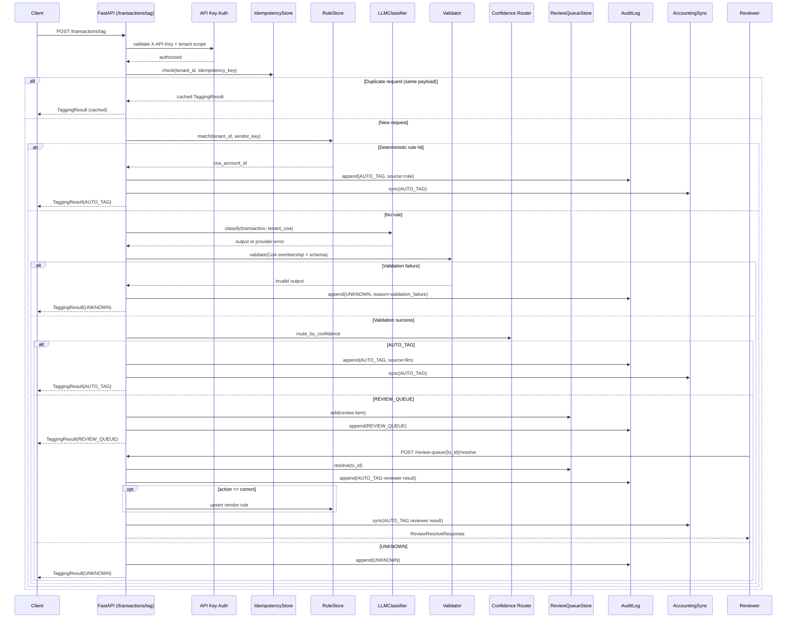
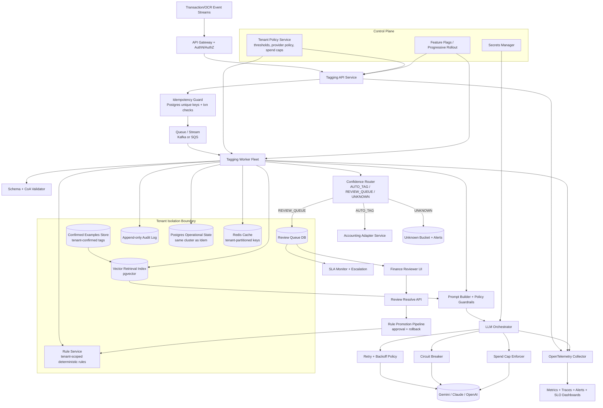

# Architecture

This document is the canonical source for system design, architecture boundaries, and production hardening direction.

## 1) Core Product Invariant

> Silent miscoding is worse than refusal.

Design consequence: any uncertain, invalid, or unavailable classification path must route to `REVIEW_QUEUE` or `UNKNOWN`, never silent `AUTO_TAG`.

## 2) End-to-End Flow

1. **Ingress**: `POST /transactions/tag` receives tenant-scoped transaction payload.
2. **Auth + tenant scope**: `X-API-Key` must match the target tenant in `data/tenants.json`.
3. **Idempotency guard**: same `(tenant_id, idempotency_key)` returns cached result; conflicting payload returns `409`.
4. **Rule-first routing**: exact normalized vendor key match in rule store yields deterministic `AUTO_TAG` (`source=rule`, `confidence=1.0`).
5. **LLM path (when no rule)**:
   - sanitize OCR text for prompt use,
   - build tenant-scoped CoA prompt + few-shot examples,
   - classify using provider chain (or deterministic fallback when live calls disabled).
6. **Output validation**: enforce schema and CoA membership.
7. **Confidence router**:
   - `>= auto_post_threshold` -> `AUTO_TAG`,
   - `>= review_threshold` -> `REVIEW_QUEUE`,
   - else -> `UNKNOWN`.
8. **Learning loop**:
   - reviewer resolves queue item (`accept`/`correct`),
   - correction can promote deterministic vendor rule for future transactions.

### Component Diagram (MVP)



### Sequence Diagram (Tag + Review Loop)



## 3) Architectural Invariants

| Invariant                                               | Enforcement                                                                   |
| ------------------------------------------------------- | ----------------------------------------------------------------------------- |
| LLM output must map to tenant CoA only                  | Validator + CoA membership check before routing                               |
| 4xx provider errors must not fan out to other providers | LLM classifier stops fallback on 4xx                                          |
| 5xx/timeouts may fallback across providers              | Provider chain retries/fallback                                               |
| All decisions are auditable                             | Audit log append on every terminal result                                     |
| Tenant isolation for reads/writes                       | Tenant-scoped stores + API key authorization                                  |
| Replay safety in review resolve                         | Replays must match original `action` + `final_coa_account_id` or return `409` |

## 4) System Components

- **API layer**: `app/main.py` (thin route wiring + auth).
- **Application service**: `app/services/tagging_service.py` (orchestration, business flow).
- **Pipeline modules**:
  - `preprocessor.py` (normalize + OCR sanitization),
  - `rule_engine.py` (deterministic lookup),
  - `llm_prompt.py` / `llm_provider.py` / `llm_classifier.py` / `llm_fallback.py`,
  - `validator.py` and `router.py`.
- **Stores**:
  - `audit_log.py`,
  - `idempotency_store.py`,
  - `review_queue.py`,
  - `confirmed_example_store.py`,
  - `retrieval_corpus_store.py` (Phase 1 retrieval corpus for future RAG),
  - `rule_store.py`.
- **Adapter**: `adapters/accounting_sync.py` (mock external accounting integration boundary).

## 5) API Contracts (MVP)

### `POST /transactions/tag`

- Input: `Transaction`
- Output: `TaggingResult`
- Error behaviors:
  - `422` schema violations,
  - `404` unknown tenant,
  - `409` idempotency payload conflict.

### `GET /review-queue/{tenant_id}`

- Returns pending review items for tenant.

### `POST /review-queue/{tx_id}/resolve`

- Input: `{tenant_id, action, final_coa_account_id, reviewer_id?}`
- Output: `ReviewResolveResponse`
- Behaviors:
  - `422` if final CoA not in tenant chart,
  - `404` if queue item missing,
  - `409` if replay payload conflicts with previously resolved payload.

### `GET /audit-log/{tenant_id}`, `GET /rules/{tenant_id}`, `GET /corpus/{tenant_id}`

- Tenant-scoped read APIs for observability, deterministic rule inspection, and **Phase 1** retrieval-corpus rows (human-confirmed labels for future RAG).

## 6) Failure-Mode Strategy

- **Provider 4xx**: terminal refusal path (`UNKNOWN`), no cross-provider retry.
- **Provider 429**: bounded retry on same provider, then fallback.
- **Provider timeout/5xx**: fallback to next provider; if exhausted -> `UNKNOWN`.
- **Invalid classifier output** (schema/CoA mismatch): `UNKNOWN`.
- **Low-confidence output**: `REVIEW_QUEUE` or `UNKNOWN` by threshold policy.
- **Empty CoA edge case**: deterministic fallback returns safe unknown-style response (no indexing crash path).

## 7) MVP vs Production Boundary

| Concern             | MVP (this repo)                                    | Production direction                               |
| ------------------- | -------------------------------------------------- | -------------------------------------------------- |
| Orchestration       | `TaggingService`; sync in-process execution        | Async workflow with queue + worker fleet           |
| Persistence         | SQLite (`data/runtime/state.db`) + JSON seed files | Postgres + migrations + backup/restore             |
| Auth                | Static per-tenant `X-API-Key`                      | OAuth2/API gateway/mTLS + key rotation             |
| LLM integration     | LiteLLM, env-driven provider chain                 | Circuit breakers, budget controls, tenant policies |
| PII                 | Regex redaction                                    | DLP/NER + policy-based retention                   |
| Observability       | Structured app logs                                | OpenTelemetry + SLOs + alerting                    |
| Concurrency control | In-process `threading.RLock`                       | Distributed locks / transactional constraints      |

### Production Target Component Diagram



### Production Target Sequence Diagram

```mermaid
sequenceDiagram
    autonumber
    participant Upstream as Upstream Stream
    participant GW as API Gateway
    participant API as Tagging API
    participant Idem as Idempotency Guard (Postgres)
    participant Q as Queue/Stream
    participant Worker as Tagging Worker
    participant Policy as Tenant Policy Service
    participant Rule as Rule Service
    participant LLM as LLM Orchestrator
    participant P1 as Provider-1 (Gemini)
    participant P2 as Provider-2 (Claude)
    participant P3 as Provider-3 (OpenAI)
    participant Router as Validator + Confidence Router
    participant Review as Review Queue DB
    participant RuleLearn as Rule Promotion Pipeline
    participant Approver as Secondary Approver / Policy Gate
    participant Status as Result API / Callback
    participant Sync as Accounting Adapter
    participant Audit as Audit Log
    participant Reviewer as Finance Reviewer
    participant Resolve as Review Resolve API

    Upstream->>GW: Transaction + tenant context
    GW->>API: Authenticated request
    API->>Idem: Reserve/check idempotency key
    alt Duplicate request (same payload)
        Idem-->>API: Cached terminal result
        API-->>GW: Return cached result
    else New request
        Idem-->>API: Accepted
        API->>Q: Enqueue classification job
        API-->>GW: 202 Accepted + tracking id
        Q->>Worker: Deliver job
        Worker->>Policy: Fetch tenant thresholds + provider policy
        Worker->>Rule: Deterministic vendor match?
        alt Rule hit
            Rule-->>Worker: CoA match
            Worker->>Router: Build AUTO_TAG (source=rule)
        else No rule
            Worker->>LLM: Classify with guardrails + timeout budget
            LLM->>P1: Primary call
            alt P1 success
                P1-->>LLM: Structured output
            else P1 429
                LLM->>LLM: Exponential backoff (bounded retries)
                LLM->>P1: Retry call
                alt Retry success
                    P1-->>LLM: Structured output
                else Retry exhausted
                    LLM->>P2: Fallback call
                    alt P2 success
                        P2-->>LLM: Structured output
                    else P2 timeout/5xx
                        LLM->>P3: Final fallback call
                        alt P3 success
                            P3-->>LLM: Structured output
                        else P3 timeout/5xx
                            LLM-->>Worker: providers_exhausted
                        end
                    end
                end
            else P1 non-429 4xx
                LLM-->>Worker: terminal refusal (no cross-provider fallback)
            end
            Worker->>Router: Validate CoA + route by confidence
        end

        alt Routed AUTO_TAG
            Worker->>Sync: Post accounting entry
            Worker->>Audit: Append AUTO_TAG event
        else Routed REVIEW_QUEUE
            Worker->>Review: Persist review item
            Worker->>Audit: Append REVIEW_QUEUE event
        else Routed UNKNOWN
            Worker->>Audit: Append UNKNOWN event
        end
        Worker->>Status: Publish terminal TaggingResult
    end
    API-->>Upstream: 202 accepted; client polls status or receives callback

    Reviewer->>Resolve: Resolve(review_item_id, action, final_coa)
    Resolve->>Review: Load + mark resolved idempotently
    alt action == correct
        Resolve->>RuleLearn: Submit promotion candidate
        RuleLearn->>Approver: Evaluate policy / concordance threshold
        alt Approved
            RuleLearn->>Rule: Upsert deterministic vendor rule
        else Not yet approved
            RuleLearn-->>Resolve: Candidate queued, rule not active yet
        end
    end
    Resolve->>Sync: Post corrected accounting entry
    Resolve->>Audit: Append reviewer resolution event
    Resolve-->>Reviewer: Resolution accepted + replay-safe response
```

**Hard MVP deployment constraint**: single-process runtime only. `threading.RLock` is process-local and does not coordinate multi-worker or multi-replica deployments.

## 8) Open Production Architecture Questions

1. Can anonymized retrieval embeddings be shared across tenants, or must retrieval stay strictly tenant-siloed?
2. What queue/DLQ strategy should absorb downstream accounting API rate limits at month-end spikes?
3. Should classification occur at authorization, settlement, or both?
4. What optimistic-locking/version contract should the review queue expose for concurrent finance operators?
5. How should account/tax/tracking dependency graphs be encoded and validated once metadata dimensions expand beyond CoA?
